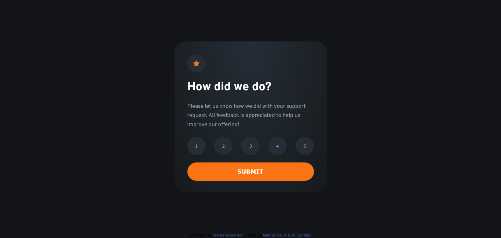
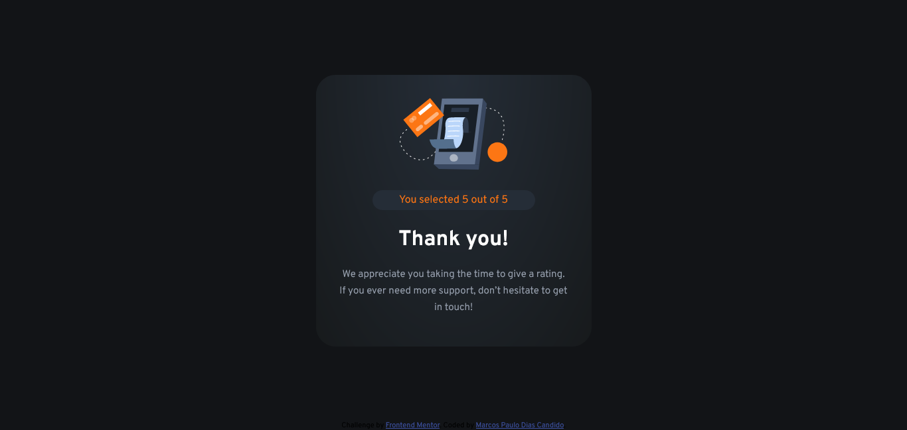

# Frontend Mentor - Interactive rating component solution

This is a solution to the [Interactive rating component challenge on Frontend Mentor](https://www.frontendmentor.io/challenges/interactive-rating-component-koxpeBUmI). Frontend Mentor challenges help you improve your coding skills by building realistic projects.

## Table of contents

- [Overview](#overview)
  - [The challenge](#the-challenge)
  - [Screenshot](#screenshot)
  - [Links](#links)
- [My process](#my-process)
  - [Built with](#built-with)
  - [What I learned](#what-i-learned)
  - [Continued development](#continued-development)
- [Author](#author)

## Overview

### The challenge

Users should be able to:

- View the optimal layout for the app depending on their device's screen size
- See hover states for all interactive elements on the page
- Select and submit a number rating
- See the "Thank you" card state after submitting a rating

### Screenshot




### Links

- Solution URL: (https://www.frontendmentor.io/solutions/interactive-rating-component-using-basic-technologies-uVOlXvqkKz)
- Live Site URL: (https://devmancrybaby.github.io/interactive-rating-component/)

## My process

### Built with

- Semantic HTML5 markup
- Flexbox
- Vanilla JS

### What I learned

Maybe my biggest challenge so far was to create the code in charge of selecting just one rating score.
I was not used to events listeners, and ended up using recursivity to build the logic.

```js
ratings.forEach((item) => {
  item.onclick = () => {
    const selectedItens = document.querySelector(".selected");
    if (selectedItens) {
      selectedItens.classList.remove("selected");
      item.onclick();
    } else {
      item.classList.add("selected");
      isRatingSelected = true;
      selectedScore = item.textContent;
      console.log(selectedScore);
    }
  };
});
```

### Continued development

I intend to improving my basic technologies (HTML, CSS, JS) capabilities, and begin to work with React as soon as possible.

## Author

- Github - [DevManCrybaby](https://github.com/DevManCrybaby)
- Frontend Mentor - [@DevmanCrybaby](https://www.frontendmentor.io/profile/DevManCrybaby)
